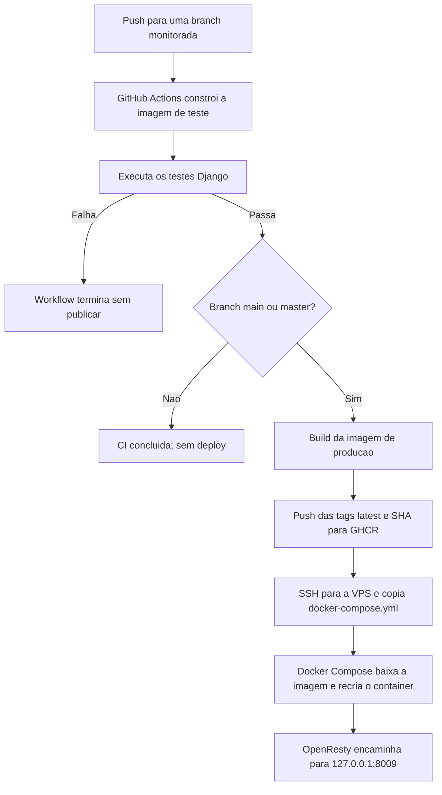

# Deploy com Docker e GitHub Actions

Este guia descreve o fluxo configurado para publicar o Tour Project em uma VPS Ubuntu. O Docker Compose executa Django/Gunicorn; o OpenResty já instalado na VPS recebe o tráfego HTTP e encaminha as requisições para a aplicação.

## Fluxo resumido

- Push em `main`, `master`, `develop` ou `github-actions-configuration` executa os testes.
- Somente push em `main` ou `master`, após os testes passarem, publica a imagem e inicia o deploy.
- O GitHub Actions publica a imagem no GitHub Container Registry (GHCR), envia o `docker-compose.yml` por SSH e executa `docker compose pull` e `docker compose up -d` na VPS.
- O Compose publica Gunicorn em `127.0.0.1:8009` no host e na porta `8000` dentro do container. O OpenResty encaminha as requisições para `http://127.0.0.1:8009`.

## Preparar a VPS uma vez

Instale Docker Engine e o plugin Docker Compose. O usuário de deploy precisa poder executar Docker. No exemplo abaixo, o usuário é `deploy`; execute os comandos de criação apenas se ele ainda não existir:

```bash
sudo adduser --disabled-password --gecos "" deploy
sudo usermod -aG docker deploy
sudo mkdir -p /srv/tour-project/data /srv/tour-project/media
sudo chown -R deploy:deploy /srv/tour-project
sudo install -d -o deploy -g deploy -m 700 /home/deploy/.ssh
```

O grupo `docker` concede privilégios equivalentes a root; dê acesso somente a uma conta confiável. Não é necessário instalar outro Nginx em container nem expor a porta `8009` publicamente.

### Chave SSH de deploy

Crie uma chave dedicada para o GitHub Actions. A chave privada será cadastrada no GitHub como `VPS_SSH_KEY`; a chave pública correspondente deve estar em `/home/deploy/.ssh/authorized_keys` na VPS. O workflow atual não configura uma senha da chave, então use uma chave sem passphrase ou altere o workflow para usar um agente SSH. Nunca comite ou envie a chave privada em mensagens.

Confirme também a chave de host da VPS. Na VPS, obtenha a impressão digital:

```bash
ssh-keygen -lf /etc/ssh/ssh_host_ed25519_key.pub
```

Compare essa impressão digital com a chave apresentada pelo servidor antes de confiar nela. Para a porta SSH padrão `22` e o IP atual, gere a linha a cadastrar como `VPS_KNOWN_HOSTS`:

```bash
awk '{print "209.00.000.00 " $1 " " $2}' /etc/ssh/ssh_host_ed25519_key.pub
```

Cadastre a linha inteira impressa. A impressão digital `SHA256:...` sozinha não é o valor de `VPS_KNOWN_HOSTS`. Se o IP ou a porta SSH mudar, atualize esse secret.

## Cadastrar secrets no GitHub

No repositório, abra **Settings → Secrets and variables → Actions → New repository secret**. Cadastre:

| Secret | Valor |
| --- | --- |
| `VPS_HOST` | IP ou hostname da VPS; atualmente `209.00.000.00`. |
| `VPS_USER` | Usuário Linux de deploy; neste setup, `deploy`. |
| `VPS_SSH_KEY` | Conteúdo completo da chave privada de deploy, incluindo as linhas `BEGIN` e `END`. |
| `VPS_KNOWN_HOSTS` | Linha completa gerada acima, depois de verificar a identidade da VPS. |
| `VPS_SSH_PORT` | Porta SSH; `22` no setup atual. Se omitida, o workflow usa `22`. |

O `GITHUB_TOKEN` usado para autenticar no GHCR é fornecido automaticamente pelo Actions. Não é necessário criar um secret para ele.

## Criar o ambiente de produção na VPS

Crie `/srv/tour-project/.env.production` diretamente na VPS. Esse arquivo não é enviado pelo workflow e deve permanecer fora do Git:

```bash
sudo nano /srv/tour-project/.env.production
```

Exemplo para testar pelo IP, substituindo os valores pelos seus:

```env
SECRET_KEY=CHAVE_FORTE_GERADA_PARA_DJANGO
DEBUG=False
ALLOWED_HOSTS=209.00.000.00
CSRF_TRUSTED_ORIGINS=http://209.00.000.00
STRIPE_PUBLISHABLE=sua_chave_publica
STRIPE_SECRET=sua_chave_secreta
EMAIL_ADDRESS=seu_email
EMAIL_PASSWORD=sua_senha_de_app
```

Gere `SECRET_KEY` na VPS com `openssl rand -hex 48`. Não use os valores de exemplo literalmente. Depois de salvar, restrinja as permissões:

```bash
sudo chown deploy:deploy /srv/tour-project/.env.production
sudo chmod 600 /srv/tour-project/.env.production
```

O Compose preserva esse arquivo durante novos deploys. Os dados SQLite ficam em `/srv/tour-project/data/db.sqlite3`; uploads ficam em `/srv/tour-project/media`. Faça backups desses dados regularmente.

## Configurar o OpenResty

No painel do OpenResty, configure o site ou host padrão para encaminhar requisições HTTP a:

```text
http://127.0.0.1:8009
```

O proxy deve preservar o cabeçalho `Host` e encaminhar `X-Forwarded-For` e `X-Forwarded-Proto`. Com o domínio ainda indisponível, é possível testar pelo IP usando HTTP. Para tráfego real, configure domínio e HTTPS; não use o site pelo IP/HTTP para logins ou pagamentos.

## Executar e acompanhar um deploy

1. Faça commit e push ou merge para `main` ou `master`. Pushes em `develop` e `github-actions-configuration` executam somente os testes.
2. Abra **GitHub → Actions → Django CI and Deploy** e acompanhe o job **Build and Test**.
3. Se os testes passarem e o push for em `main` ou `master`, o job **Publish image and deploy to VPS** cria e publica as tags `latest` e o SHA do commit no GHCR.
4. O workflow conecta por SSH, copia o Compose, autentica no GHCR, baixa a imagem e recria o container. O arquivo `.env.production` e os dados persistentes permanecem na VPS.
5. Na VPS, confirme o estado e os logs:

   ```bash
   cd /srv/tour-project
   docker compose ps
   docker logs --tail 100 tour-project-app
   curl -i -H 'Host: 209.00.000.00' http://127.0.0.1:8009/
   ```

   O último comando testa diretamente Django/Gunicorn. Para testar também o OpenResty, use `curl -i -H 'Host: 209.00.000.00' http://127.0.0.1/` na VPS e depois abra `http://209.00.000.00` no navegador. A porta `8009` deve continuar vinculada somente a `127.0.0.1`.

## Observações de operação

- O log atual da VPS reportou alterações em modelos de `checkout` e `tour_store` sem migrações correspondentes. Antes do próximo deploy com mudanças de modelo, gere e versione as migrações no repositório, por exemplo com `python manage.py makemigrations checkout tour_store`, e rode os testes. O entrypoint executa `migrate`, mas não cria migrações.
- O log também alerta que a aplicação usa CKEditor 4. Planeje migrar para uma alternativa mantida; não é esse aviso que causou o `HTTP 400` anterior.
- Se o deploy falhar, consulte o primeiro passo marcado como falha no job **Publish image and deploy to VPS**. Nunca compartilhe chaves SSH, valores de secrets ou o conteúdo de `.env.production`.

## Fluxograma

